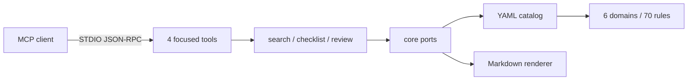

# 서비스 구조

Commerce Context MCP는 한국 커머스와 Java/Spring 설계 지침을 로컬 MCP 클라이언트에 제공하는 STDIO 전용 서버입니다. 네트워크 서버나 외부 LLM을 실행하지 않고, JAR에 포함된 YAML을 메모리에서 검색합니다.

## 설계 목표

1. AI가 고르기 쉬운 작은 Tool 표면을 유지한다.
2. 검색 결과가 선택된 이유와 지식의 검증 수준을 함께 반환한다.
3. 결제·세무·보안처럼 위험한 내용을 확정 사실처럼 표현하지 않는다.
4. core가 Spring, MCP, YAML에 의존하지 않게 한다.
5. 새 domain YAML을 Java 설정 변경 없이 발견한다.

## 처리 흐름

서버는 시작할 때 YAML을 한 번 읽고 불변 객체로 보관합니다. 검색은 외부 API·DB·벡터 저장소를 호출하지 않으므로 지연시간과 장애 지점이 작고, 같은 입력에는 같은 결과를 냅니다.

## 계층과 의존 방향

| 위치 | 책임 |
|---|---|
| `core/model` | 규칙, 적용 조건, 근거 수준, 검색·검토 결과 |
| `core/port` | 카탈로그, 검색, 검토, 렌더링 인터페이스 |
| `application/search` | 정규화, lexical 점수, query coverage, 필터와 정렬 |
| `application/checklist` | 중복 없는 최대 10개 체크리스트 조합 |
| `application/review` | 관련 규칙을 찾는 결정론적 1차 검토 |
| `adapter/out/yaml` | `knowledge/*.yml` 자동 발견, 변환과 계약 검증 |
| `adapter/out/render` | 신뢰 메타데이터를 포함한 Markdown 생성 |
| `adapter/in/mcp` | Tool 4개, Resource 3종, Prompt 2종 |

의존 방향은 `adapter → application → core`입니다. core에는 Spring annotation, 파일 I/O, Jackson 또는 MCP 타입이 없습니다. 이 구조는 단일 책임과 의존성 역전을 지키면서도 현재 규모에 불필요한 계층을 추가하지 않습니다.

## 공개 MCP 인터페이스

| Tool | 사용할 때 |
|---|---|
| `search_knowledge` | 규칙 ID를 모르는 일반적인 설계·구현 질문 |
| `get_rule` | 선택한 ID의 적용 조건, 예외, 체크리스트와 출처 확인 |
| `get_checklist` | domain·시나리오별 구현 점검표 생성 |
| `review_commerce_design` | 설계안·API·DDL·코드 조각의 검토 후보 탐색 |

정적 규칙마다 Tool을 만들지 않습니다. 이전의 도메인별 37개 Tool은 같은 내용을 중복 노출하고 AI의 선택 비용을 키워 제거했습니다. Tool 수는 계약 테스트와 실제 JSON-RPC smoke test에서 4개로 고정합니다.

Resource:

- `commerce://catalog`
- `commerce://domains/{domain}`
- `commerce://rules/{ruleId}`

Prompt:

- `review-commerce-api`
- `review-payment-webhook`

Resource와 Prompt를 지원하지 않는 클라이언트도 Tool 4개만으로 전체 기능을 사용할 수 있습니다.

Tool의 요약 상태·위험도·근거 수준 값은 JSON에서 `needs-review`, `review-required`, `project-guidance`처럼 소문자 kebab-case로 통일합니다.

## 검색과 응답 제한

검색은 Unicode NFKC·소문자 정규화 후 ID, 제목, 별칭, 태그, domain, category, 요약, 본문에 가중치를 적용합니다. 여러 검색어 중 몇 개가 실제로 일치했는지 `queryCoverage`에 반영하고, 동점은 domain·category·ID로 안정 정렬합니다. `matchConfidence`는 검색 일치도이며 내용의 사실성을 보증하지 않습니다.

- 기본 결과 5개, 최대 10개
- 체크리스트 최대 10개 규칙
- 본문 section 수가 많은 규칙도 body 한 필드로 계산
- 점수, coverage, 매칭 필드와 검색어 공개
- 외부 검색·임베딩·LLM 호출 없음

`review_commerce_design`은 코드 실행이나 의미 분석기가 아닙니다. 입력 텍스트와 관련된 규칙을 `review_required` 후보로 반환하며, 실제 결함 확정은 호출한 AI와 사람이 코드 흐름·계약·운영 환경을 확인해야 합니다.

## 지식 신뢰성 모델

각 규칙은 다음 값을 응답에 노출합니다.

| 필드 | 의미 |
|---|---|
| `status: active` | 카탈로그에서 일반 설계 지침으로 사용 중 |
| `status: needs-review` | 고위험이거나 출처·검토일·적용 조건 확인이 부족함 |
| `evidenceLevel: external-source` | URL을 가진 외부 근거가 명시됨 |
| `evidenceLevel: project-guidance` | 프로젝트가 관리하는 지침이며 독립 외부 근거는 아님 |
| `evidenceLevel: unsourced` | 근거가 없어 사용 전 보완 필요 |
| `owner` | 규칙을 유지·관리하는 팀 또는 역할 |
| `verifiedBy` | 실제 검토자. 기록이 없으면 `null` 또는 `not-recorded` |
| `lastReviewedAt` | 실제 YAML에 기록된 검토일. 없으면 `null` 또는 `not-recorded` |
| `sourceVersion`, `accessedAt` | 외부 자료의 버전과 실제 확인일. 존재하는 경우에만 기록 |
| `changeNote` | 규칙 내용 변경의 짧은 이유. 존재하는 경우에만 기록 |

검토자나 검토일을 자동 생성하지 않습니다. 외부 근거가 없는 규칙에는 해당 YAML 경로와 “프로젝트 관리 지침”이라는 주의문만 붙입니다. High·Critical 규칙이 적용 조건, 실제 검토자·검토일, 명시적 evidence를 모두 갖추지 못하면 자동으로 `needs-review`가 됩니다. 만료일과 재검토 주기는 관리하지 않습니다.

따라서 `active`는 법적·기술적 정답을 보증한다는 뜻이 아닙니다. 결제사 계약, 세무·법률, 보안, 개인정보, 보존 기간은 최신 공식 자료와 전문가 검토로 확정해야 합니다.

## 경량 실행 구조

- STDIO 단일 transport
- `web-application-type: none`
- Tomcat, Spring Web, Actuator 미포함
- 외부 포트·DB·캐시·스케줄러 없음
- 통합 Tool 4개만 Spring bean으로 등록
- npm 실행 시 UTF-8 고정

현재 검증 빌드의 fat JAR는 약 23MiB입니다. 크기는 라이브러리 버전에 따라 달라질 수 있으므로 CI에서는 절대값보다 웹 서버 의존성이 다시 포함되지 않는지와 실제 MCP 시작 성공을 확인합니다.

## 검증 경계

- YAML schema v1: domain owner, 필수 값, 전역 ID, related ID, 상태와 실제 검토 정보
- 검색: 100건 평가, 70개 규칙 전체 커버리지, Top-1·Top-3·결과 없음 측정
- 검토·체크리스트·신뢰 정책: 45건 평가
- MCP: Tool 4개 고정, Resource·Prompt 목록, 한국어 `tools/call`
- 신뢰성: 누락 검토일 미생성, 고위험 규칙 `needs-review`, evidence level 노출
- 패키지: Java 17, HTTPS, SHA-256 fail-closed, 잠금·원자적 캐시 교체

개발·릴리스 명령은 [기여 가이드](../CONTRIBUTING.md), 전체 지식 범위는 [지식 카탈로그](DOMAIN_KNOWLEDGE_REFERENCE.md)를 참고하세요.
